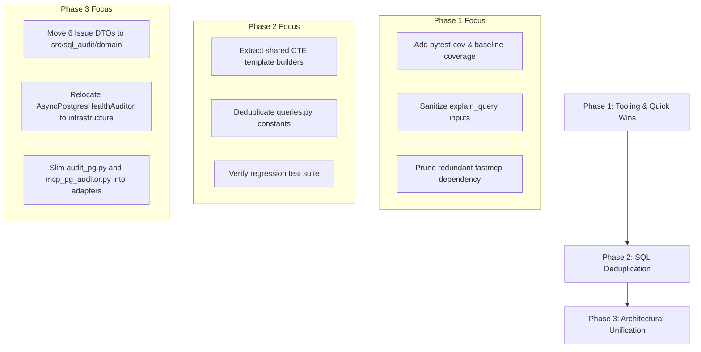

# Verified Audit Report & Improvement Plan — Herraminetas SQL

**Repo**: `c:\Users\cerra\codigo\Herraminetas_Sql`  
**Date**: 2026-10-04  
**Baseline Test Suite**: 139 passed, 0 failed  
**Linter**: ruff — clean  
**Type Checker**: mypy strict — clean  

---

## Executive Summary & Verification

This document consolidates and reconciles the project audit against the actual codebase as of October 2026. 

An initial exploratory audit identified several potential areas for improvement. Verification against the live source code revealed that two high-visibility findings were **false positives** caused by outdated historical design notes, while one dependency recommendation was based on a conceptual misunderstanding of the official MCP SDK.

Below is the authoritative ledger of dismissed items, validated technical debt, and a concrete 3-phase execution roadmap.

---

## Dismissed Findings (False Positives)

### 1. QUAL-02 & TEST-01 — Critical Check Rendering & Tests
- **Claim**: `render_text()` in `audit_pg.py` fails to display the 3 critical checks (`invalid_indexes`, `unindexed_fks`, `autovacuum_dead_tuples`), and `test_render.py` lacks corresponding tests.
- **Status**: **DISMISSED (FALSE POSITIVE)**
- **Verification Proof**:
  - `audit_pg.py` lines 511–575 explicitly render sections `[1] INVALID INDEXES`, `[2] UNINDEXED FOREIGN KEYS`, and `[3] AUTOVACUUM & DEAD TUPLES LAG`.
  - `tests/test_render.py` line 133 (`test_render_text_with_critical_issues`) and line 155 (`test_render_quiet_with_all_checks`) verify these rendering branches. All 139 tests pass.
- **Root Cause**: The original auditor referenced historical "open questions" in `openspec/` documentation that had already been resolved and implemented in code.

### 2. DEP-01 — `fastmcp` in `[project.optional-dependencies] mcp`
- **Claim**: `mcp_pg_auditor.py` imports FastMCP and requires adding `fastmcp>=2.0.0` to the `mcp` optional dependency group.
- **Status**: **DISMISSED (CONCEPTUAL ERROR)**
- **Verification Proof**:
  - `mcp_pg_auditor.py` line 19 imports `from mcp.server.fastmcp import FastMCP`, which is provided directly by the official `mcp>=1.0.0,<2` SDK (already specified under `[project.optional-dependencies] mcp`).
  - The standalone third-party `fastmcp` package in `[dependency-groups] dev` is redundant noise and should be removed, not promoted to production dependencies.

---

## Verified Technical Debt & Findings

### Category: Architecture & Design
- **ARCH-01 (MEDIUM)**: **Dual Domain Representation**. The 6 issue types are declared as `@dataclass` in `audit_pg.py` and as Pydantic models in `mcp_pg_auditor.py`, then converted via `convert_legacy_report_to_audit_report()`. This creates a 3-way synchronization requirement whenever an issue attribute changes.
- **ARCH-02 (MEDIUM)**: **Monolithic CLI Entrypoint**. `audit_pg.py` encapsulates CLI presentation, domain models, database driver logic (`PostgresHealthAuditor`), and credential parsing in a single file (~1100 lines).
- **ARCH-03 (LOW)**: **Unpackaged Async Auditor**. `AsyncPostgresHealthAuditor` is defined directly inside `mcp_pg_auditor.py` instead of residing in `src/sql_audit/infrastructure/`.

### Category: Code Quality & Security
- **QUAL-01 (MEDIUM)**: **SQL Query Duplication**. 23 SQL constants in `src/sql_audit/infrastructure/queries.py` duplicate large CTE logic across psycopg2 (`%s`), asyncpg (`$N`), and filtered vs. unfiltered variants.
- **ERR-02 / SEC-01 (LOW)**: **EXPLAIN Query Input Validation**. `explain_query()` formats raw query text directly into `EXPLAIN (COSTS, VERBOSE, FORMAT JSON) {query}`. Basic statement validation (rejecting multi-statement queries or unstripped semicolons) should be enforced before execution.

### Category: Testing & Tooling
- **TEST-05 (LOW)**: **Missing Coverage Tooling**. `pytest-cov` is absent from development dependencies, making code coverage during refactoring invisible.
- **DEP-CLEANUP (LOW)**: **Redundant Dev Dependencies**. Standalone `fastmcp` in `dev` dependencies causes confusion with `mcp.server.fastmcp`.

---

## Action Plan & Phased Roadmap

### Phase 1: Tooling & Quick Wins (Harness & Hygiene)
Establish measurable safety rails before performing structural changes.
- [x] Add `pytest-cov` to `pyproject.toml` dev dependencies and configure coverage reporting in `[tool.pytest.ini_options]`.
- [x] Prune redundant `fastmcp>=2.0.0` from `[dependency-groups] dev` in `pyproject.toml`.
- [x] Add query validation to `explain_query` in both `audit_pg.py` and `mcp_pg_auditor.py` (reject multi-statements, trim trailing semicolons).
- [x] Add unit test verifying that `explain_query` rejects multi-statement SQL strings.
- [x] Run test suite and record baseline test coverage.

### Phase 2: SQL Deduplication & Template Builder (QUAL-01)
Reduce query maintenance overhead and eliminate query divergence risk.
- [x] Implement query builder helpers in `src/sql_audit/infrastructure/queries.py` for shared CTE fragments (Table Bloat, Index Bloat, HOT updates).
- [x] Parameterize placeholder format (`%s` vs `$N`) and schema filter predicates.
- [x] Verify that generated query strings match expected dialect requirements.
- [x] Ensure all 139+ tests pass without behavioral drift.

### Phase 3: Architectural Unification (ARCH-01, ARCH-02, ARCH-03)
Align CLI and MCP runners with the core hexagonal package.
- [x] Define canonical frozen issue DTOs in `src/sql_audit/domain/issues.py`.
- [x] Move `AsyncPostgresHealthAuditor` to `src/sql_audit/infrastructure/async_auditor.py`.
- [x] Move `PostgresHealthAuditor` to `src/sql_audit/infrastructure/sync_auditor.py`.
- [x] Refactor `audit_pg.py` and `mcp_pg_auditor.py` to import models and auditors from the package, reducing top-level scripts to thin entrypoints.
- [x] Update mapping logic in `src/sql_audit/application/mapping.py` to directly consume canonical models.
- [x] Run full test suite with coverage verification to guarantee zero regression.
